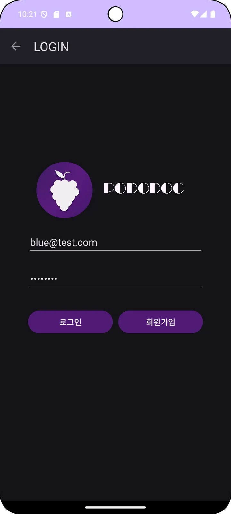
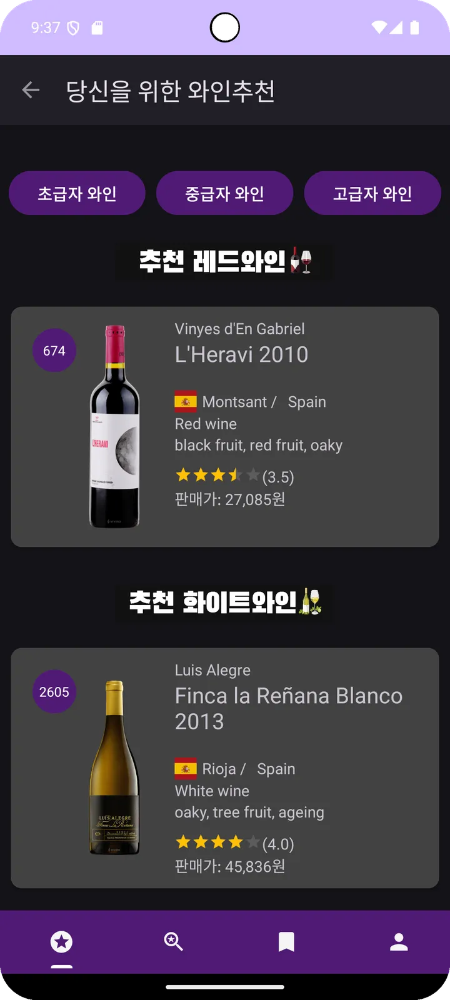
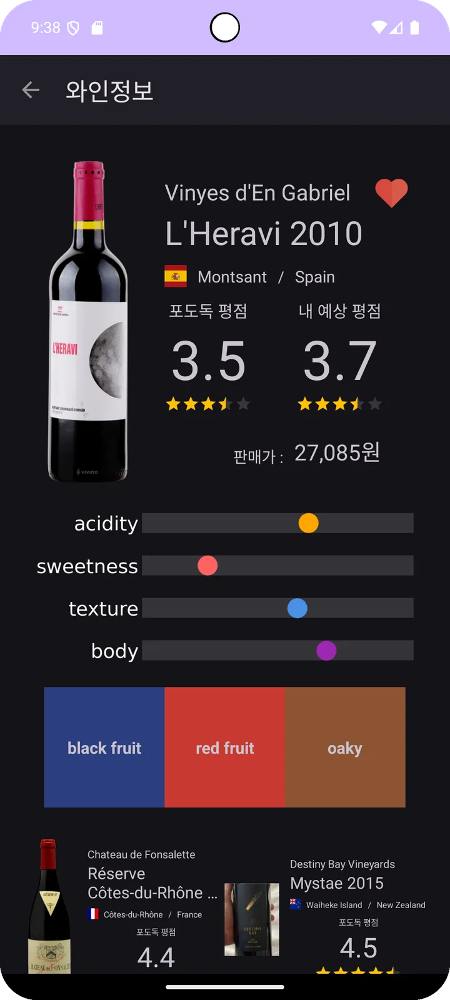
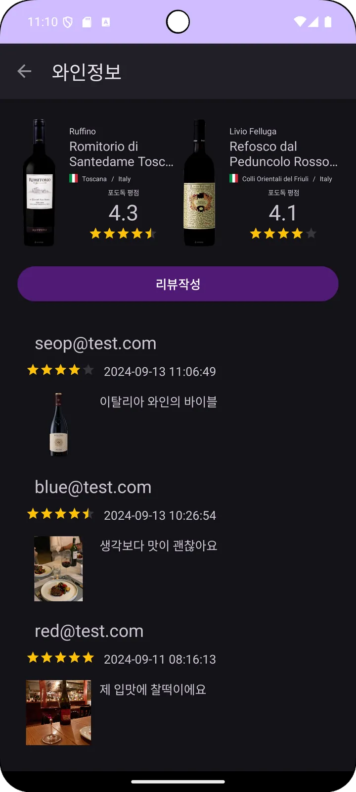
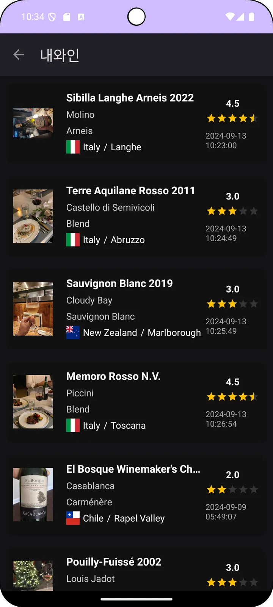
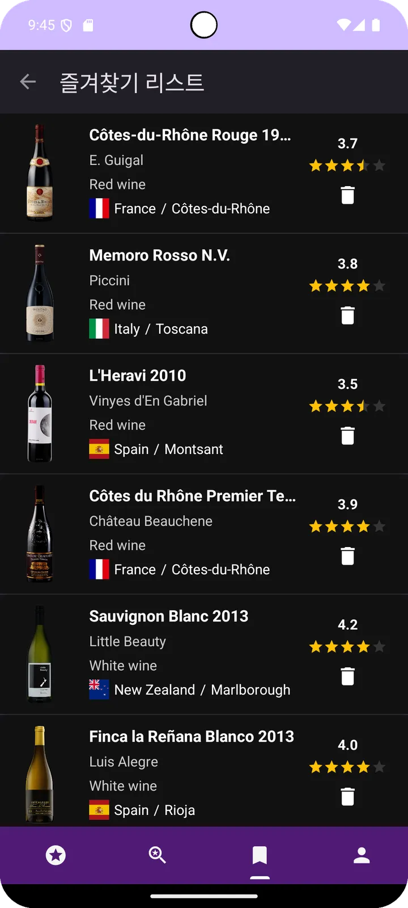
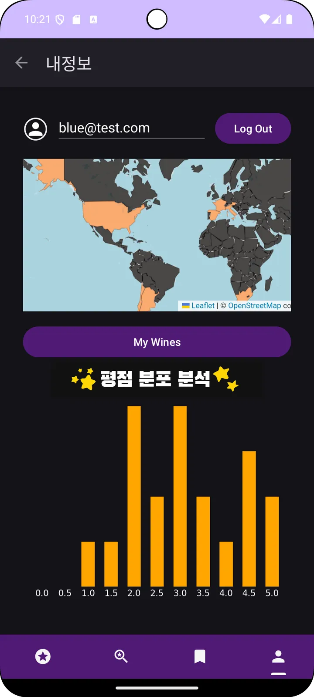

# 🍇 Pododoc: AI 기반 개인 맞춤형 와인 추천 시스템

Pododoc은 사용자의 와인 시음 기록과 평점을 기반으로 머신러닝을 통해 취향을 분석하고, 개인 맞춤형 와인을 추천해주는 안드로이드 애플리케이션입니다.

## 📸 스크린샷

  
  
  
  

  
  
  

## ✨ 프로젝트 개요

기존의 데이터베이스 기반 추천 시스템의 한계를 극복하고자, 사용자의 실제 시음 데이터를 바탕으로 머신러닝 예측 모델과 유사도 측정 알고리즘을 적용하여 정교하고 개인화된 와인 추천 경험을 제공합니다.

## 🚀 주요 기능

### 📱 와인 관리
- **와인 기록 및 평점**: 사용자가 마신 와인에 대한 정보와 별점 기록
- **시음 노트**: 상세한 와인 시음 경험 저장
- **개인 와인 컬렉션**: 마신 와인들의 히스토리 관리

### 🤖 AI 기반 추천
- **평점 예측 모델**: scikit-learn 기반 머신러닝으로 미시음 와인의 예상 평점 예측
- **유사도 기반 추천**: 유클리드 거리를 이용한 유사 와인 추천
- **개인화된 추천**: 사용자의 취향을 학습하여 맞춤형 와인 제안

### 📊 데이터 시각화
- **취향 분석**: 선호하는 와인 품종, 국가별 통계
- **평점 분포**: 개인의 와인 평가 패턴 시각화
- **지역별 분석**: 지도 기반 와인 생산지 정보

### 🔍 검색 및 탐색
- **고급 검색**: 품종, 국가, 가격대별 와인 검색
- **카테고리별 탐색**: 적포도주/백포도주별 분류
- **상세 정보**: 와인의 세부 특성 및 평가 정보

## 🛠️ 기술 스택

### Backend & AI
- **Python 3.x**: 메인 개발 언어
- **Flask 3.0.3**: RESTful API 서버 프레임워크
- **scikit-learn 1.5.1**: 머신러닝 모델 구현
- **pandas 2.2.2**: 데이터 분석 및 처리
- **matplotlib 3.9.1**: 데이터 시각화
- **folium 0.17.0**: 지도 기반 시각화

### Database & Cloud
- **Firebase Admin 6.5.0**: 실시간 데이터베이스 및 인증
- **Google Sheets API**: 데이터 저장 및 관리
- **gspread 6.1.2**: Google Sheets 연동

### Frontend
- **Android (Java)**: 네이티브 안드로이드 개발
- **Retrofit2**: HTTP 통신 라이브러리
- **Firebase SDK**: 클라우드 서비스 연동

## 📊 머신러닝 모델

### 와인 평점 예측
- **알고리즘**: Random Forest Regressor
- **특성**: 알코올 도수, 산도, 당도, 타닌 등 와인의 화학적 특성
- **평가지표**: MAE, RMSE, R² 스코어

### 유사도 기반 추천
- **거리 측정**: 유클리드 거리 (Euclidean Distance)
- **특성 벡터**: 다차원 와인 특성 공간에서의 유사도 계산
- **추천 로직**: 높게 평가한 와인과 유사한 특성을 가진 와인 추천

## 📄 라이센스

이 프로젝트는 개인 학습 목적으로 제작되었습니다.

---

**Pododoc** - 당신만의 완벽한 와인을 찾아드립니다 🍷